# FinSight

[](https://github.com/UmaisNisar/finsight/actions/workflows/ci.yml)


**An AI personal finance analyzer that reads your bank statements and explains where your money goes.**

FinSight finds statements in Gmail (or takes the PDFs you download from your bank), extracts every transaction, categorizes spending, detects subscriptions and unusual charges, and uses Gemini to write plain-language insights. Every number is calculated by FinSight; the AI only explains them, and its answers are validated before you see them.


## Features

- **Statements from where they already are.** Scans Gmail for statement PDFs, and for "your eStatement is ready" alerts from banks that don't attach them (CIBC, for example), with a trusted sign-in link and one-click upload for each month.
- **Guided onboarding.** A single setup page asks how you get statements, connects Gmail or walks you through downloading from your bank, lets you confirm what was found, and helps you add your own Gemini API key.
- **Layout-aware PDF parsing.** Works across bank layouts: debit/credit columns, running balances, wrapped descriptions, card statements with two dates. Statements that reconcile are marked high confidence.
- **Categorization you can correct.** Rules first, AI only for merchants it doesn't know, and your edits become rules for future imports.
- **Insights with guardrails.** Spending trends, savings rate, recurring payments, anomalies, and a Gemini-written summary checked against the real figures.
- **Private by design.** PDFs are never stored, account numbers are masked to the last four digits, tokens and keys are encrypted, and every user's data is isolated at the database layer.
- **Apple Liquid Glass interface.** Translucent materials, native-feeling controls, loading states sized like their content, and motion for everything that appears or disappears.

| Insights | Transactions |
| --- | --- |
|  |  |
| **Onboarding** | **Statement alerts** |
|  |  |

## How it works

The pipeline is split so the AI never does arithmetic:

```mermaid
flowchart LR
  A[Gmail search<br/>or PDF upload] --> B[Statement detection]
  B --> C[PDF text extraction<br/>in memory]
  C --> D[Layout-aware parsing]
  D --> E[Normalization and<br/>duplicate detection]
  E --> F[Rule categorization]
  F --> G[AI categorization<br/>unknown merchants only]
  G --> H[Transfer matching]
  H --> I[Deterministic metrics]
  I --> J[Gemini explanation]
  J --> K[Validation]
  K --> L[Dashboard]
```



| Layer | Stack |
| --- | --- |
| Backend | .NET 10, ASP.NET Core, EF Core (SQLite locally, PostgreSQL in containers), PdfPig, Data Protection |
| Frontend | React 19, TypeScript, Vite, TanStack Query, zod, Tailwind CSS 4, Motion, Recharts |
| AI | Google Gemini with structured output, behind one service and a set of validators |
| Tests | xUnit + FluentAssertions, Vitest + Testing Library, GitHub Actions |

## Getting started

**Prerequisites:** [.NET SDK 10](https://dotnet.microsoft.com/download) and [Node.js 22+](https://nodejs.org/).

```bash
git clone https://github.com/UmaisNisar/finsight.git
cd finsight

# Terminal 1: API on http://localhost:5085 (creates the SQLite database and applies migrations)
dotnet run --project server/FinSight.Api

# Terminal 2: web app on http://localhost:5173 (proxies /api to the API)
cd web
npm install
npm run dev
```

Open http://localhost:5173 and choose **Explore with sample data**. Demo mode needs no credentials: it creates a temporary user with 12 months of synthetic transactions from a fictional bank, deleted after 24 hours.

### Configuration

Secrets never go in `appsettings.json` or the frontend. In development, use user secrets:

```bash
cd server/FinSight.Api
dotnet user-secrets set "Gemini:ApiKey" "<key from https://aistudio.google.com/apikey>"   # optional
dotnet user-secrets set "Google:ClientId" "<oauth client id>"                              # for Google sign-in
dotnet user-secrets set "Google:ClientSecret" "<oauth client secret>"
```

In production, use environment variables: `Gemini__ApiKey`, `Google__ClientId`, `Google__ClientSecret`, `ConnectionStrings__FinSight`. [Deployment](#deployment) lists everything a container needs.

| Setting | Purpose |
| --- | --- |
| `Gemini:ApiKey` | Optional server-wide key. Users can add their own key in onboarding or Settings; theirs is used when present. Without any key, merchants are categorized by rules, recurring payments are labelled from a built-in list, and FinSight writes the insight summary itself from the computed figures. |
| `Gemini:Model`, `Gemini:FallbackModels` | The model chain, best first (default `gemini-2.5-flash`, then `gemini-3.6-flash`, `gemini-3.5-flash`, `gemini-2.5-flash-lite`, `gemini-3.5-flash-lite`, `gemini-3.1-flash-lite`). The free tier caps requests per day per model, so each fallback adds a day's allowance. Set `Gemini__FallbackModels=` (empty) to turn fallback off. |
| `Ai:DailyLimits:*`, `Ai:GlobalDailyLimit`, `Ai:PriorityEmails` | Per-account daily Gemini calls by kind (categorization batches 40, analyses 20, recurring reviews 20), a daily ceiling for the server's key across all accounts (400), and accounts exempt from that ceiling. Counted in memory: they reset at midnight UTC and on restart. |
| `Google:ClientId` / `Google:ClientSecret` | Enables Google sign-in and Gmail. Without them, demo mode and PDF upload still work. |
| `ForwardedHeaders:Enabled` | Set to `true` behind a reverse proxy that terminates HTTPS, and list the proxies in `ForwardedHeaders:KnownProxies`. Off by default so clients can't spoof their address past rate limits. |
| `RateLimits:DemoPerHour`, `RateLimits:UploadsPerHour` | Per-address demo sign-ins (default 20) and per-user uploads (default 120). |
| `Uploads:MaxQueuedMegabytes` | Memory for uploaded PDFs waiting to be processed, across all users (default 256). Uploads beyond it get a 429. |
| `DataProtection:KeysPath` | Where the encryption key ring lives (default `.data/keys`, next to the database). Keep it out of database backups. |
| `DataProtection:CertificatePath` / `DataProtection:CertificatePassword` | A PKCS#12 certificate that encrypts the key ring at rest. Without one, the key ring is DPAPI-encrypted on Windows. On Linux and macOS outside Development, FinSight refuses to start rather than store it **unencrypted**, unless `DataProtection:AllowUnprotectedKeys` is `true`. |
| `Database:Provider` | `Sqlite` (default) or `Postgres`, with a matching `ConnectionStrings:FinSight`. See [Deployment](#deployment). |

<details>
<summary><strong>Setting up Google sign-in and Gmail</strong></summary>

Sign-in asks only for basic profile scopes. Gmail read-only access is requested separately (incremental consent) when the user connects Gmail, with offline access so later scans work. The refresh token is encrypted server-side and never reaches the browser.

**In [Google Cloud Console](https://console.cloud.google.com/)** (OAuth pages are under **Google Auth Platform**):

1. **Project:** create or pick one.
2. **Gmail API:** in **APIs & Services → Library**, enable **Gmail API**.
3. **Branding:** set the app name, user support email and developer contact.
4. **Audience:** choose **External**, keep **Testing**, and add your Gmail address under **Test users**.
5. **Data Access:** add `openid`, `userinfo.email`, `userinfo.profile`, and manually add `https://www.googleapis.com/auth/gmail.readonly`.
6. **Clients:** create a **Web application** client with:
   - Authorized JavaScript origin: `http://localhost:5173`
   - Authorized redirect URI: `http://localhost:5173/api/auth/google/callback`

Save the client ID and secret with `dotnet user-secrets` (above), then restart the API; the Google handler is registered at startup.

**Verify:** open http://localhost:5173/api/auth/diagnostics (Development only; it never shows credential values). `handlerRegistered` should be `true` and `redirectUri` should match the one above. Then click **Continue with Google** on http://localhost:5173.

| Symptom | Cause |
| --- | --- |
| `redirect_uri_mismatch` | The client's redirect URI doesn't exactly match (scheme, `localhost` vs `127.0.0.1`, port, trailing slash). Console changes can take a few minutes. |
| "has not completed the Google verification process" | Your account isn't listed as a test user. |
| Back on the welcome page with "sign-in didn't complete" | The flow started on `:5085` or `127.0.0.1`. Always use http://localhost:5173. |
| "FinSight needs permission to read Gmail" | The Gmail checkbox was unticked on the consent screen. |

In Testing mode Google expires refresh tokens after 7 days; FinSight then shows the connection as expired with a **Reconnect** button. `gmail.readonly` is a restricted scope, so a public launch requires Google's app verification and security assessment.

</details>

### Automation and email

Users can opt in (Settings → Automation) to a daily Gmail scan, to automatic import for accounts they've imported before, and to a monthly summary email sent from the 3rd of each month for the previous month. Scans only find statements; nothing else is imported without the user.

| Setting | Purpose |
| --- | --- |
| `Automation:Enabled` | Runs scheduled scans and summary emails (default `true`). `false` stops both for everyone. |
| `Automation:ScanInterval` | Time between a user's scans (default `1.00:00:00`, minimum one hour). Each user gets a stable time of day. |
| `App:PublicUrl` | The address users open FinSight at, for links in email (for example `https://finsight.example.com`). Required for email outside Development, where it defaults to `http://localhost:5173`. |
| `Email:From`, `Email:FromName` | Sender address and name (default name `FinSight`). |
| `Email:Smtp:Host`, `Email:Smtp:Port`, `Email:Smtp:Username` | SMTP server (port default 587). |
| `Email:Smtp:Password` | Secret: user secrets or `Email__Smtp__Password` only. |
| `Email:Smtp:Security` | `StartTls` (default), `SslOnConnect` (usually port 465), or `None` for a relay on localhost only. |

Without an SMTP host, Development writes each message as an `.eml` file to `server/FinSight.Api/.data/mail` (or `Email:PickupDirectory`), so you can open summaries locally without a mail server. In other environments email is reported as not configured, and Settings says so. **Send a test** in Settings emails you last month's summary (3 an hour, `RateLimits:TestEmailsPerHour`).

## Deployment

FinSight ships as one container image: the API serves the built web app on port 8080. It runs on any container host; there's no hosted instance.

### Run locally with Docker Compose

```bash
cp .env.example .env    # set POSTGRES_PASSWORD; the defaults enable demo mode and allow an unencrypted key ring
docker compose up --build
```

Open http://localhost:8080 and choose **Explore with sample data**. Compose runs the image in the `Production` environment with PostgreSQL 17, a read-only root filesystem, and named volumes for the database (`postgres-data`) and the key ring (`finsight-data`). In Production the session cookie is `__Host-` and `Secure`. Chrome, Edge and Firefox accept that on `http://localhost`, but anywhere else FinSight must be served over HTTPS.

### Container image

Every push to `main` that passes CI, and every `v*` tag, publishes a `linux/amd64` and `linux/arm64` image ([release.yml](.github/workflows/release.yml)) with SBOM and provenance attestations. The image is scanned with Trivy first: a critical vulnerability that has a fix stops the release, and results go to code scanning.

```bash
docker pull ghcr.io/umaisnisar/finsight:latest
```

| Tag | Points to |
| --- | --- |
| `latest`, `main` | The latest commit on `main` that passed CI |
| `sha-<commit>` | One specific commit (use this, or the digest, in production) |
| `1.2.3`, `1.2` | Release tag `v1.2.3` |

To run the published image with Compose instead of building it, set `FINSIGHT_IMAGE=ghcr.io/umaisnisar/finsight:latest` in `.env`.

The image is based on `mcr.microsoft.com/dotnet/aspnet:10.0-noble-chiseled-extra`, which has no shell or package manager. It runs as the non-root user `app` (UID 1654) and logs JSON to stdout. Its only writable path is `/data`, for the key ring, so mount a volume there. It has no `HEALTHCHECK`, because there's no shell or `curl` to run one. Point your platform's probes at the [health endpoints](#health-checks) instead.

### Configuration for production

Set these as environment variables (`:` becomes `__`).

| Variable | Required | Purpose |
| --- | --- | --- |
| `Database__Provider` | Yes | `Postgres`. (`Sqlite` also works for a single container, with the database file on the `/data` volume.) |
| `ConnectionStrings__FinSight` | Yes | For example `Host=db;Port=5432;Database=finsight;Username=finsight;Password=...;SSL Mode=Require` |
| `DataProtection__CertificatePath`, `DataProtection__CertificatePassword` | Yes | A PKCS#12 certificate, mounted read-only, that encrypts the key ring. |
| `DataProtection__KeysPath` | No | Key ring directory. The image sets `/data/keys`. |
| `DataProtection__AllowUnprotectedKeys` | No | `true` lets FinSight start without a certificate and store the key ring unencrypted. For local testing only. |
| `AllowedHosts` | Yes | Host names the app answers to, separated by `;` (for example `finsight.example.com`). Other hosts get a 400. |
| `App__PublicUrl` | For email | For example `https://finsight.example.com`. |
| `ForwardedHeaders__Enabled` | Behind a proxy | `true` when a reverse proxy terminates TLS (see below). |
| `ForwardedHeaders__KnownProxies__0` | Recommended | The proxy's IP address, when it's fixed. |
| `Google__ClientId`, `Google__ClientSecret` | For Google sign-in | Register `https://<your host>/api/auth/google/callback` as a redirect URI. |
| `Gemini__ApiKey` | No | Server-wide Gemini key. |
| `Email__From`, `Email__Smtp__Host`, `Email__Smtp__Username`, `Email__Smtp__Password` | For summary emails | See [Automation and email](#automation-and-email). |
| `Database__MigrateOnStartup` | No | Default `true`. |
| `Demo__Enabled` | No | Default `false` in Production. Demo users can use the server's Gemini key, within rate limits. |

**Key ring certificate.** The key ring decrypts transaction descriptions, Gmail refresh tokens and Gemini keys. Without a certificate, FinSight refuses to start on Linux outside Development, unless `DataProtection__AllowUnprotectedKeys=true`. A self-signed certificate is enough:

```bash
openssl req -x509 -newkey rsa:3072 -sha256 -days 3650 -nodes -subj "/CN=FinSight key ring" -keyout keyring.key -out keyring.crt
openssl pkcs12 -export -inkey keyring.key -in keyring.crt -out keyring.pfx   # prompts for a password
```

Mount `keyring.pfx` read-only (for example at `/run/secrets/keyring.pfx`) and pass its password as a secret. Keep both out of the image and out of database backups. If the certificate or the key ring is lost, encrypted fields read as `[unavailable]` and Gmail must be reconnected. Keep the certificate available even after it expires, because existing keys still need it to decrypt.

### Behind a reverse proxy with TLS

Terminate HTTPS at a proxy (Caddy, nginx, Traefik or the platform's load balancer) that forwards to port 8080 and sets `X-Forwarded-For` and `X-Forwarded-Proto`. Then:

- Set `ForwardedHeaders__Enabled=true`, plus `ForwardedHeaders__KnownProxies__0` if the proxy's address is fixed. Make sure only the proxy can reach port 8080. Otherwise clients could spoof their address to get around rate limits.
- Redirect HTTP to HTTPS at the proxy. FinSight sends HSTS on HTTPS requests, but it can't redirect on its own when it only listens on HTTP. It logs `Failed to determine the https port for redirect` once.
- Set `AllowedHosts` to your domain and `App__PublicUrl` to the HTTPS address.

### Health checks

| Endpoint | Returns 200 when |
| --- | --- |
| `GET /health/live` | The process is serving requests (liveness). |
| `GET /health/ready` | The database accepts connections (readiness). Otherwise it returns 503. |

Both endpoints are anonymous, exempt from rate limits, and return only `Healthy` or `Unhealthy`. `AllowedHosts` applies to them too, so probes must send an allowed `Host` header.

### Database and migrations

Migrations run when the app starts (`Database__MigrateOnStartup`, default `true`). On PostgreSQL they run inside a session advisory lock, so instances that start together migrate one at a time. To migrate as a separate release step instead:

1. Set `Database__MigrateOnStartup=false` on the app.
2. Run the same image once with `Database__MigrateOnly=true`. It applies the migrations and exits.

To update, pull the new image and restart. The new version migrates the database as it starts. Migrations only go forward, so back up before you update. To roll back, restore that backup and run the previous image.

EF Core migrations are specific to each database provider. SQLite's are in `server/FinSight.Infrastructure/Persistence/Migrations` and PostgreSQL's are in `server/FinSight.Migrations.Postgres`. A model change needs a migration in both:

```bash
dotnet ef migrations add <Name> -p server/FinSight.Infrastructure -s server/FinSight.Api -o Persistence/Migrations
dotnet ef migrations add <Name> -p server/FinSight.Migrations.Postgres -s server/FinSight.Api -o Migrations -- --Database:Provider=Postgres "--ConnectionStrings:FinSight=Host=localhost;Database=finsight"
```

Generating a migration doesn't connect to the database. The tests check both sets against the model (PostgreSQL's when `FINSIGHT_TEST_POSTGRES` is set, as in CI).

### Backups

- **Database:** run `pg_dump --format=custom` on a schedule, or use your provider's managed backups, and test that restores work.
- **Key ring:** back up the `/data/keys` volume and the certificate **separately** from the database, with different access. Encrypted fields in a database backup can only be read with the key ring. Without it, a stolen database exposes only the unencrypted columns (see [security and privacy](docs/security-and-privacy.md#limitations-and-honest-caveats)).

### Scaling

Run **one instance**:

- Uploaded PDFs wait in an in-memory queue, and background workers in the same process handle them. A second instance would neither see nor process the first one's uploads.
- Rate limits and short-lived caches are per process.
- The automation scheduler claims each user's scan and summary email with conditional database updates, so it won't send twice, but the job queue still needs a single instance.

Scaling out needs a durable job queue (see [Roadmap](#roadmap)). Multiple instances would also have to share the key ring volume and the certificate.

### Deploying to a host

The release workflow ends with a commented-out placeholder for a deploy job (Fly.io, Azure Container Apps or Render). On any host:

- Deploy by digest or `sha-` tag.
- Give the app the variables above as secrets.
- Mount a persistent volume at `/data`.
- Use managed PostgreSQL with TLS.
- Configure `/health/live` and `/health/ready` as probes.

## Testing

```bash
dotnet test FinSight.slnx                                          # backend
cd web && npm run lint && npm run typecheck && npm test && npm run build   # frontend
```

[GitHub Actions](.github/workflows/ci.yml) runs both suites on every push to `main` and on every pull request. It also builds the container image and runs the backend tests again against a PostgreSQL 17 service container.

PostgreSQL tests are skipped unless `FINSIGHT_TEST_POSTGRES` points at a server where tests may create and drop databases. Setting `FINSIGHT_TEST_PROVIDER=Postgres` as well runs the whole API suite on PostgreSQL:

```bash
export FINSIGHT_TEST_POSTGRES="Host=localhost;Port=5432;Username=postgres;Password=postgres"
dotnet test FinSight.slnx --filter "Category=Postgres"                                                   # persistence and API on PostgreSQL
FINSIGHT_TEST_PROVIDER=Postgres dotnet test FinSight.slnx --filter "FullyQualifiedName~FinSight.Tests.Api"   # the whole API suite
```

- **Core logic:** statement parsing across layouts, money and date formats, masking, merchant normalization, categorization rules, transfer matching, metrics, recurring and anomaly detection, and the validators that check every AI answer.
- **Persistence and security:** migrations match the model (SQLite and PostgreSQL), ownership filters fail closed, cross-user writes are refused, sensitive fields are encrypted at rest, and token and key encryption use separate purposes.
- **External services:** Gemini, Gmail and Google OAuth clients against scripted HTTP responses: retries, rate limits, malformed responses, expired grants and revocation. No real network calls.
- **Pipeline:** imports, duplicates, overlapping statements, reprocessing that keeps user edits, unreadable PDFs, Gmail discovery, statement alerts, AI categorization and demo data expiry.
- **API end to end:** the real app against a temporary database with Gemini replaced by a script: authentication, CSRF, security headers, rate limiting, open-redirect protection, user isolation, validation errors, onboarding and per-user AI keys.
- **Frontend:** API contracts against real response fixtures, controls and keyboard behaviour, loading states that keep cards in place, onboarding paths and resume, statement alerts and uploads, and error boundaries.

## Project structure

```
server/
  FinSight.Core/            Domain logic with no I/O: parsing, normalization, categories, analytics, AI validators
  FinSight.Infrastructure/  EF Core persistence, Gmail and Google OAuth, PdfPig, Gemini, pipeline and background jobs
  FinSight.Migrations.Postgres/  EF Core migrations for PostgreSQL
  FinSight.Api/             Controllers, authentication, security middleware, rate limits
  FinSight.Tests/           Unit, integration and end-to-end API tests
web/src/
  api/                      Client, endpoints, TanStack Query hooks, zod schemas
  app/                      Routing, app shell, providers
  components/               UI primitives, error boundaries, shared components
  features/                 Overview, transactions, statements, insights, recurring, onboarding, settings
  hooks/  lib/              Shared hooks and utilities
```

## Security and privacy

The verified, detailed account (what is collected, stored, encrypted and shared, and the limitations) is [docs/security-and-privacy.md](docs/security-and-privacy.md). To report a vulnerability, see [SECURITY.md](SECURITY.md).

- **Secrets:** OAuth refresh tokens and users' Gemini keys are encrypted with ASP.NET Core Data Protection and never sent to the browser. A saved key is only ever shown as its last four characters. The key ring is encrypted with DPAPI on Windows or a configured certificate. On other platforms, FinSight refuses to start in production with an unencrypted key ring unless explicitly allowed.
- **Financial data:** PDFs are processed in memory and never written to disk, not even as temporary upload buffers; only a SHA-256 hash is kept. Card and account numbers are masked to the last four digits before storage or AI. Transaction descriptions are encrypted at rest; amounts, dates, merchant names and statement details are not, so the database itself must be protected.
- **What the AI sees:** aggregates, category totals, merchant names, dates and amounts of notable transactions, and, for categorization, masked statement descriptors. Never account numbers, email content, or the user's name or email address. Merchant names come from statement text, so a transfer to a person can include that person's name.
- **Isolation:** every user-owned table has an EF Core query filter bound to the signed-in user that fails closed, and writes to another user's rows are refused.
- **Web security:** HttpOnly SameSite cookies tied to a server-side session (signing out ends it on the server, so a copied cookie stops working; sessions end 30 days after sign-in), a required custom header on state-changing requests (CSRF), CSP and security headers, rate limits on sensitive endpoints, request size limits, bounded PDF parsing, and error responses with stable codes instead of stack traces.
- **User control:** disconnect Gmail (revoked at Google) and delete transactions, statements, all data or the account at any time.

## Statement files: PDF, CSV, OFX and QFX

Upload a PDF statement, or the CSV, OFX or QFX transaction download most banks offer. Structured downloads are the most accurate. All of them go through the same pipeline: duplicate detection, categorization, transfer matching and statement alert matching.

- **Detected by content, not by name.** `%PDF-` means PDF, an OFX header or `<OFX>` root means OFX (QFX when it carries `INTU.BID` or a `.qfx` name), and delimited text means CSV. Anything else is refused with `unsupported_file`.
- **OFX 1.x (SGML) and 2.x (XML)**, bank and card statements. Account IDs are masked to the last four digits as they're read. Dates keep the calendar date the bank wrote (`20260815120000[-5:EST]` is Aug 15). `FITID` goes into the fingerprint, so re-imports and overlapping downloads dedupe exactly. Card files that list charges as positive are detected and flipped.
- **CSV layouts are detected, never assumed:** the delimiter (comma, semicolon, tab), quoting, BOM, an optional header and preamble, day-first or month-first dates across every row, one signed amount column or separate debit and credit columns, and a balance column. Headerless CIBC, TD and older Scotiabank downloads, and headed RBC, Tangerine, Scotiabank, Simplii, BMO and American Express exports, also name the bank. A file that can't be mapped fails with `csv_unrecognized` instead of being guessed.
- **Limits:** 20 MB, 20,000 transactions and 15 seconds per file. Parsers live in `FinSight.Core/Import` behind `IStatementFileParser`.
- **Password-protected PDFs:** the upload row or the statement's details ask for the password and send the same file again with it. The password is used for that one read and never stored or logged. A wrong one fails with `pdf_password_incorrect`.

## Design decisions

- **Gemini never does arithmetic.** Figures in AI responses are overwritten with computed values, invented categories and merchants are removed, and unmatched currency amounts are flagged. Corrections are visible in the UI.
- **AI is optional, and its absence is honest.** Gemini calls walk a chain of models: a refused key stops at once (every model shares it), a 429 moves straight to the next model, other 4xx move on, and 5xx, network errors and unusable JSON are retried once first, all within one time budget. When the chain fails, or there's no key, or a daily limit is reached, FinSight writes the summary from the same facts through the same validator and says why ("Written by FinSight without AI. Gemini's daily limit was reached…"). Merchants left uncategorized are retried later, and the next generate with AI replaces the built-in summary.
- **Sign-in links come from code, not email.** Statement alert cards link only to a hard-coded list of official bank URLs, so a phishing email can't insert its own link.
- **Merchant rules are keyed by the bank's merchant key,** not the user's renamed display name, and AI categorization is done per money direction, so a refund and a purchase at the same store don't collide.
- **Money is stored as integer cents** and timestamps as ticks, because SQLite can't compare decimals or `DateTimeOffset` values reliably. PostgreSQL uses the same model and converters, so both databases store and sort values the same way.

## Roadmap

- OCR for scanned PDFs (detected and reported today; an OCR engine would implement `IPdfTextExtractor`)
- Notifications for new statements
- Currency conversion for multi-currency accounts
- A durable job queue for multi-instance hosting
