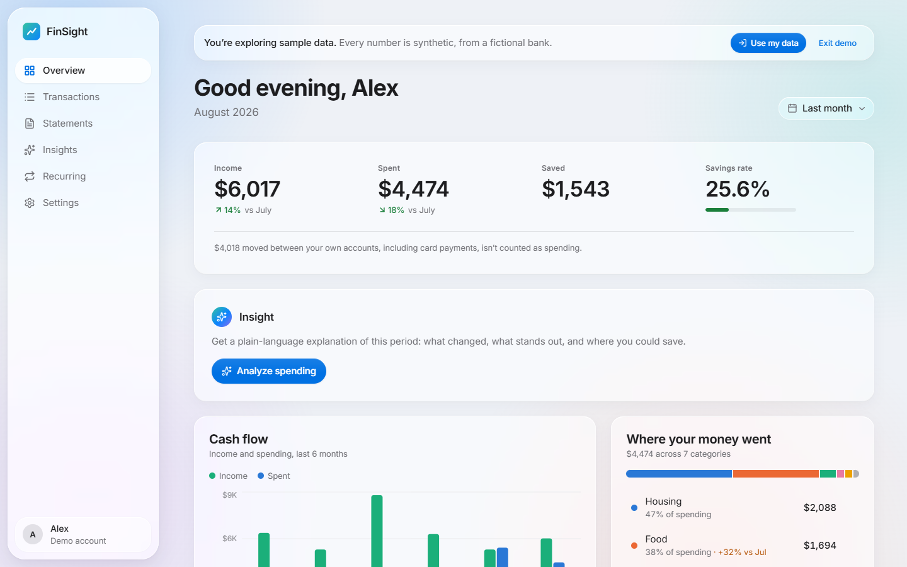
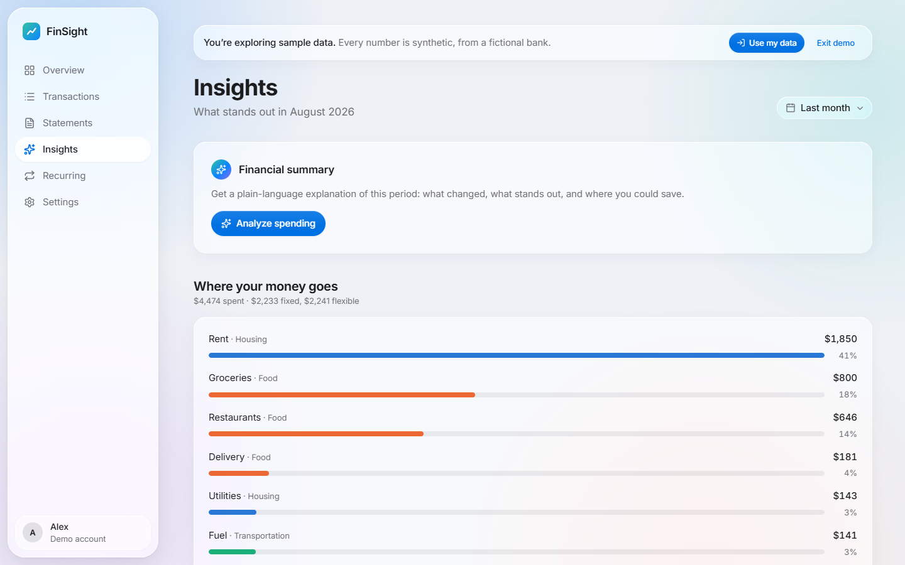
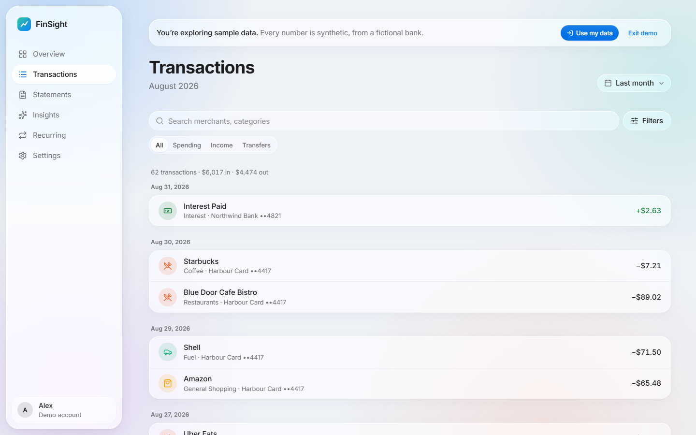
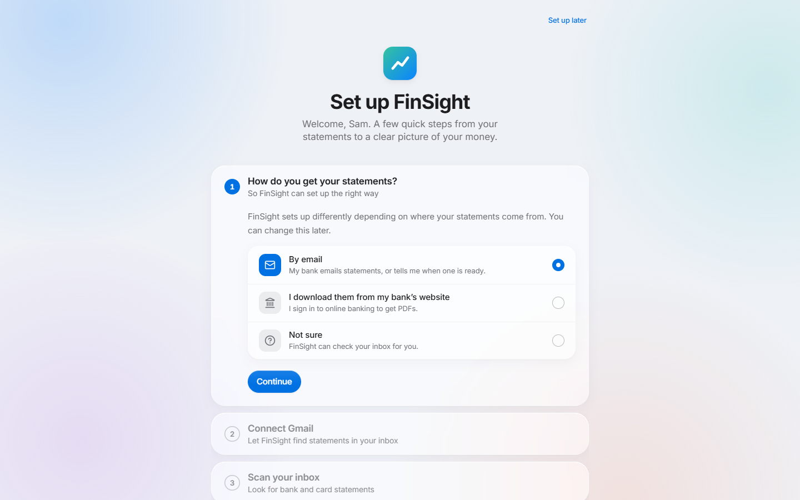
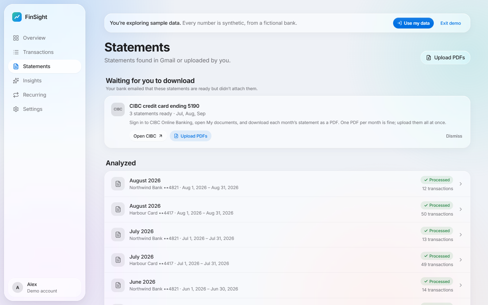

# FinSight

[](https://github.com/UmaisNisar/finsight/actions/workflows/ci.yml)


**An AI personal finance analyzer that reads your bank statements and explains where your money goes.**

FinSight finds statements in Gmail (or takes the PDFs you download from your bank), extracts every transaction, categorizes spending, detects subscriptions and unusual charges, and uses Gemini to write plain-language insights. Every number is calculated by FinSight; the AI only explains them, and its answers are validated before you see them.



## Features

- **Statements from where they already are.** Scans Gmail for statement PDFs, and for "your eStatement is ready" alerts from banks that don't attach them (CIBC, for example), with a trusted sign-in link and one-click upload for each month.
- **Guided onboarding.** A single setup page asks how you get statements, connects Gmail or walks you through downloading from your bank, lets you confirm what was found, and helps you add your own Gemini API key.
- **Layout-aware PDF parsing.** Works across bank layouts: debit/credit columns, running balances, wrapped descriptions, card statements with two dates. Statements that reconcile are marked high confidence.
- **Categorization you can correct.** Rules first, AI only for merchants it doesn't know, and your edits become rules for future imports.
- **Insights with guardrails.** Spending trends, savings rate, recurring payments, anomalies, and a Gemini-written summary checked against the real figures.
- **Private by design.** PDFs are never stored, account numbers are masked to the last four digits, tokens and keys are encrypted, and every user's data is isolated at the database layer.
- **Apple Liquid Glass interface.** Translucent materials, native-feeling controls, loading states sized like their content, and motion for everything that appears or disappears.

| Insights | Transactions |
| --- | --- |
|  |  |
| **Onboarding** | **Statement alerts** |
|  |  |

## How it works

The pipeline is split so the AI never does arithmetic:

```mermaid
flowchart LR
  A[Gmail search<br/>or PDF upload] --> B[Statement detection]
  B --> C[PDF text extraction<br/>in memory]
  C --> D[Layout-aware parsing]
  D --> E[Normalization and<br/>duplicate detection]
  E --> F[Rule categorization]
  F --> G[AI categorization<br/>unknown merchants only]
  G --> H[Transfer matching]
  H --> I[Deterministic metrics]
  I --> J[Gemini explanation]
  J --> K[Validation]
  K --> L[Dashboard]
```



| Layer | Stack |
| --- | --- |
| Backend | .NET 10, ASP.NET Core, EF Core (SQLite), PdfPig, Data Protection |
| Frontend | React 19, TypeScript, Vite, TanStack Query, zod, Tailwind CSS 4, Motion, Recharts |
| AI | Google Gemini with structured output, behind one service and a set of validators |
| Tests | xUnit + FluentAssertions, Vitest + Testing Library, GitHub Actions |

## Getting started

**Prerequisites:** [.NET SDK 10](https://dotnet.microsoft.com/download) and [Node.js 22+](https://nodejs.org/).

```bash
git clone https://github.com/UmaisNisar/finsight.git
cd finsight

# Terminal 1: API on http://localhost:5085 (creates the SQLite database and applies migrations)
dotnet run --project server/FinSight.Api

# Terminal 2: web app on http://localhost:5173 (proxies /api to the API)
cd web
npm install
npm run dev
```

Open http://localhost:5173 and choose **Explore with sample data**. Demo mode needs no credentials: it creates a temporary user with 12 months of synthetic transactions from a fictional bank, deleted after 24 hours.

### Configuration

Secrets never go in `appsettings.json` or the frontend. In development, use user secrets:

```bash
cd server/FinSight.Api
dotnet user-secrets set "Gemini:ApiKey" "<key from https://aistudio.google.com/apikey>"   # optional
dotnet user-secrets set "Google:ClientId" "<oauth client id>"                              # for Google sign-in
dotnet user-secrets set "Google:ClientSecret" "<oauth client secret>"
```

In production, use environment variables: `Gemini__ApiKey`, `Google__ClientId`, `Google__ClientSecret`, `ConnectionStrings__FinSight`.

| Setting | Purpose |
| --- | --- |
| `Gemini:ApiKey` | Optional server-wide key. Users can add their own key in onboarding or Settings; theirs is used when present. Without any key, everything works except AI categorization and insights. |
| `Google:ClientId` / `Google:ClientSecret` | Enables Google sign-in and Gmail. Without them, demo mode and PDF upload still work. |
| `ForwardedHeaders:Enabled` | Set to `true` behind a reverse proxy that terminates HTTPS, and list the proxies in `ForwardedHeaders:KnownProxies`. Off by default so clients can't spoof their address past rate limits. |
| `RateLimits:DemoPerHour`, `RateLimits:UploadsPerHour` | Per-address demo sign-ins (default 20) and per-user uploads (default 120). |
| `Uploads:MaxQueuedMegabytes` | Memory for uploaded PDFs waiting to be processed, across all users (default 256). Uploads beyond it get a 429. |
| `DataProtection:KeysPath` | Where the encryption key ring lives (default `.data/keys`, next to the database). Keep it out of database backups. |
| `DataProtection:CertificatePath` / `DataProtection:CertificatePassword` | A PKCS#12 certificate that encrypts the key ring at rest. Set it on Linux and macOS; without it the key ring is DPAPI-encrypted on Windows and **unencrypted** elsewhere. |

<details>
<summary><strong>Setting up Google sign-in and Gmail</strong></summary>

Sign-in asks only for basic profile scopes. Gmail read-only access is requested separately (incremental consent) when the user connects Gmail, with offline access so later scans work. The refresh token is encrypted server-side and never reaches the browser.

**In [Google Cloud Console](https://console.cloud.google.com/)** (OAuth pages are under **Google Auth Platform**):

1. **Project:** create or pick one.
2. **Gmail API:** in **APIs & Services → Library**, enable **Gmail API**.
3. **Branding:** set the app name, user support email and developer contact.
4. **Audience:** choose **External**, keep **Testing**, and add your Gmail address under **Test users**.
5. **Data Access:** add `openid`, `userinfo.email`, `userinfo.profile`, and manually add `https://www.googleapis.com/auth/gmail.readonly`.
6. **Clients:** create a **Web application** client with:
   - Authorized JavaScript origin: `http://localhost:5173`
   - Authorized redirect URI: `http://localhost:5173/api/auth/google/callback`

Save the client ID and secret with `dotnet user-secrets` (above), then restart the API; the Google handler is registered at startup.

**Verify:** open http://localhost:5173/api/auth/diagnostics (Development only; it never shows credential values). `handlerRegistered` should be `true` and `redirectUri` should match the one above. Then click **Continue with Google** on http://localhost:5173.

| Symptom | Cause |
| --- | --- |
| `redirect_uri_mismatch` | The client's redirect URI doesn't exactly match (scheme, `localhost` vs `127.0.0.1`, port, trailing slash). Console changes can take a few minutes. |
| "has not completed the Google verification process" | Your account isn't listed as a test user. |
| Back on the welcome page with "sign-in didn't complete" | The flow started on `:5085` or `127.0.0.1`. Always use http://localhost:5173. |
| "FinSight needs permission to read Gmail" | The Gmail checkbox was unticked on the consent screen. |

In Testing mode Google expires refresh tokens after 7 days; FinSight then shows the connection as expired with a **Reconnect** button. `gmail.readonly` is a restricted scope, so a public launch requires Google's app verification and security assessment.

</details>

## Testing

```bash
dotnet test FinSight.slnx                                          # backend
cd web && npm run lint && npm run typecheck && npm test && npm run build   # frontend
```

[GitHub Actions](.github/workflows/ci.yml) runs both suites on every push to `main` and on every pull request.

- **Core logic:** statement parsing across layouts, money and date formats, masking, merchant normalization, categorization rules, transfer matching, metrics, recurring and anomaly detection, and the validators that check every AI answer.
- **Persistence and security:** migrations match the model, ownership filters fail closed, cross-user writes are refused, sensitive fields are encrypted at rest, and token and key encryption use separate purposes.
- **External services:** Gemini, Gmail and Google OAuth clients against scripted HTTP responses: retries, rate limits, malformed responses, expired grants and revocation. No real network calls.
- **Pipeline:** imports, duplicates, overlapping statements, reprocessing that keeps user edits, unreadable PDFs, Gmail discovery, statement alerts, AI categorization and demo data expiry.
- **API end to end:** the real app against a temporary database with Gemini replaced by a script: authentication, CSRF, security headers, rate limiting, open-redirect protection, user isolation, validation errors, onboarding and per-user AI keys.
- **Frontend:** API contracts against real response fixtures, controls and keyboard behaviour, loading states that keep cards in place, onboarding paths and resume, statement alerts and uploads, and error boundaries.

## Project structure

```
server/
  FinSight.Core/            Domain logic with no I/O: parsing, normalization, categories, analytics, AI validators
  FinSight.Infrastructure/  EF Core persistence, Gmail and Google OAuth, PdfPig, Gemini, pipeline and background jobs
  FinSight.Api/             Controllers, authentication, security middleware, rate limits
  FinSight.Tests/           Unit, integration and end-to-end API tests
web/src/
  api/                      Client, endpoints, TanStack Query hooks, zod schemas
  app/                      Routing, app shell, providers
  components/               UI primitives, error boundaries, shared components
  features/                 Overview, transactions, statements, insights, recurring, onboarding, settings
  hooks/  lib/              Shared hooks and utilities
```

## Security and privacy

The verified, detailed account (what is collected, stored, encrypted and shared, and the limitations) is [docs/security-and-privacy.md](docs/security-and-privacy.md). To report a vulnerability, see [SECURITY.md](SECURITY.md).

- **Secrets:** OAuth refresh tokens and users' Gemini keys are encrypted with ASP.NET Core Data Protection and never sent to the browser. A saved key is only ever shown as its last four characters. The key ring is encrypted with DPAPI on Windows or a configured certificate.
- **Financial data:** PDFs are processed in memory and never written to disk, not even as temporary upload buffers; only a SHA-256 hash is kept. Card and account numbers are masked to the last four digits before storage or AI. Transaction descriptions are encrypted at rest; amounts, dates, merchant names and statement details are not, so the database file itself must be protected.
- **What the AI sees:** aggregates, category totals, merchant names, dates and amounts of notable transactions, and, for categorization, masked statement descriptors. Never account numbers, email content, or the user's name or email address. Merchant names come from statement text, so a transfer to a person can include that person's name.
- **Isolation:** every user-owned table has an EF Core query filter bound to the signed-in user that fails closed, and writes to another user's rows are refused.
- **Web security:** HttpOnly SameSite cookies tied to a server-side session (signing out ends it on the server, so a copied cookie stops working; sessions end 30 days after sign-in), a required custom header on state-changing requests (CSRF), CSP and security headers, rate limits on sensitive endpoints, request size limits, bounded PDF parsing, and error responses with stable codes instead of stack traces.
- **User control:** disconnect Gmail (revoked at Google) and delete transactions, statements, all data or the account at any time.

## Design decisions

- **Gemini never does arithmetic.** Figures in AI responses are overwritten with computed values, invented categories and merchants are removed, and unmatched currency amounts are flagged. Corrections are visible in the UI.
- **Sign-in links come from code, not email.** Statement alert cards link only to a hard-coded list of official bank URLs, so a phishing email can't insert its own link.
- **Merchant rules are keyed by the bank's merchant key,** not the user's renamed display name, and AI categorization is done per money direction, so a refund and a purchase at the same store don't collide.
- **Money is stored as integer cents** and timestamps as ticks, because SQLite can't compare decimals or `DateTimeOffset` values reliably.

## Roadmap

- OCR for scanned PDFs (detected and reported today; an OCR engine would implement `IPdfTextExtractor`)
- Password-protected PDFs (detected; no password prompt yet)
- Notifications for new statements
- Currency conversion for multi-currency accounts
- A durable job queue and PostgreSQL for multi-instance hosting
